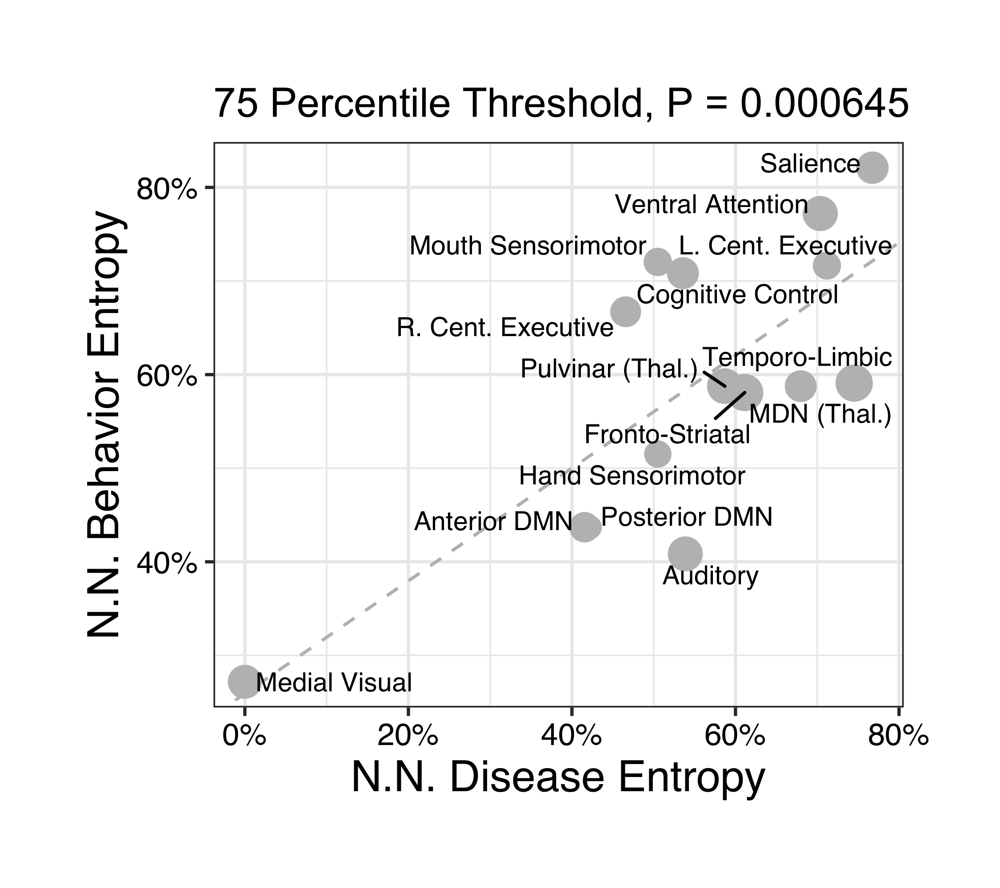
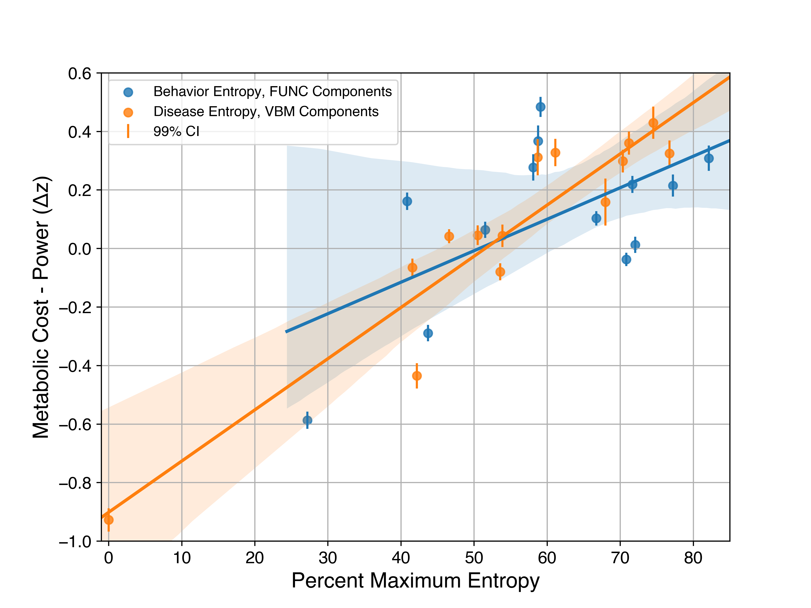

# "Brain pathology recapitulates physiology: A network meta-analysis" by Vanasse & Fox et al. (2021) in Communications Biology 
# Code
(1) img_correlation_testing.ipynb is script testing correspondence between functional and structural components  
(2) entropy_calculation.ipynb is script calculating disease/behavior diversity of components   
(3) linear_model.ipynb calculates disease/behavior diversity association  
(4) energetic_cost_power_model.ipynb performs metabolic association test  

# Data
(1) data folder stores structural and functional images (also available at: http://brainmap.org/pubs/ or http://anima.fz-juelich.de/studies/Vanasse_Fox_2019 )  
(2) behavior and diease component loading at data/python_entropy_analysis  
(3) data/1000_iter_10-9-2019_os.npy is output of noise simulation strategy  
(4) metabolic data can be aquired by data request to authors (https://doi.org/10.1038/s41467-019-08546-x) 

# Manuscript Figures

## Suplmentary Figure 1

## Suplmentary Figure 2a

## Suplmentary Figure 2b

