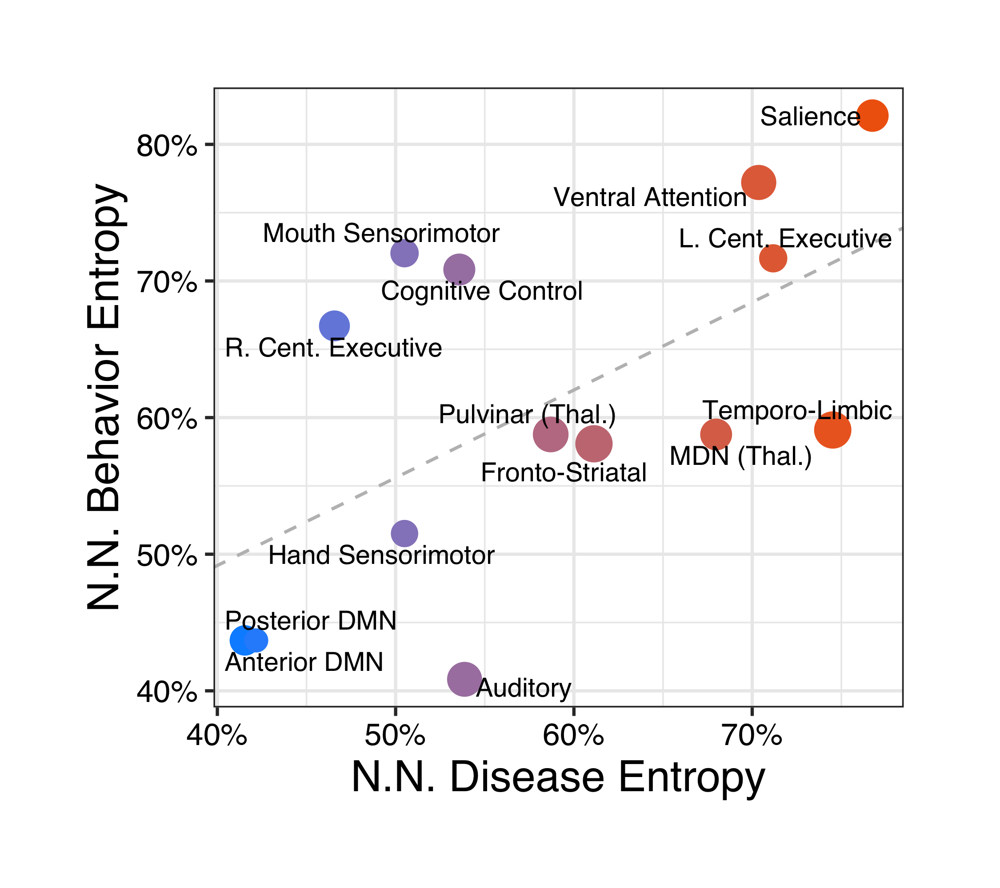
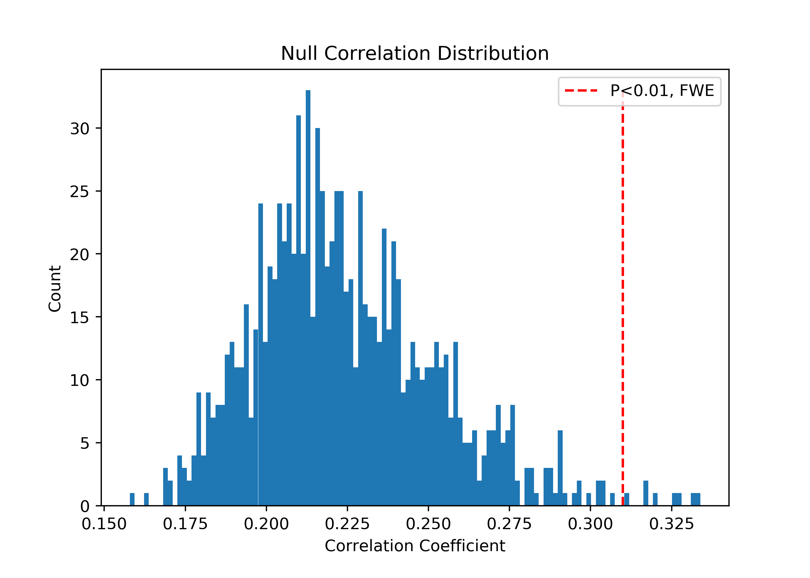
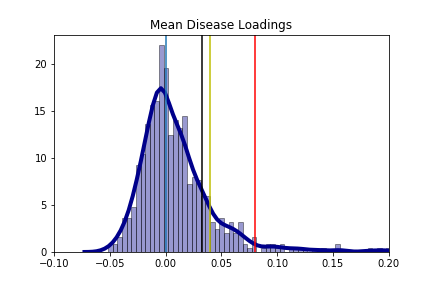

# "Correspondence of functional co-activation and structural co-alteration brain networks: A transdiagnostic meta-analysis" by Vanasse et al.
# Code
(1) img_correlation_testing.ipynb is script testing correspondence between functional and structural components  
(2) entropy_calculation.ipynb is script calculating disease/behavior diversity of components   
(3) linear_model.ipynb calculates disease/behavior diversity association  

# Data
(1) data folder stores structural and functional images (also available at: http://anima.fz-juelich.de/studies/Vanasse_Fox_2019 )  
(2) behavior and diease component loading at data/python_entropy_analysis  
(3) data/1000_iter_11-18.npy is output of noise simulation strategy   

# Manuscript Figures

## Suplmentary Figure 1

## Suplmentary Figure 2a

## Suplmentary Figure 2b

